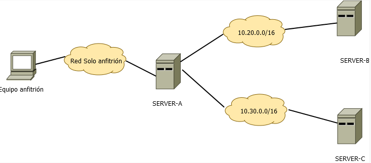

```
---------------- ADMINISTRACIÓN DE SISTEMAS INFORMÁTICOS Y REDES ----------------
---------------------------------------------------------------------------------

Módulo:                     ADMINISTRACIÓN DE SISTEMAS OPERATIVOS
Profesor:                   Víctor J. González
Unidad de Trabajo:          UT02
Práctica:                   PR0202. El protocolo SSH
Resultados de aprendizaje:  RA4
```

# PR0202: El protocolo SSH

## Entorno de trabajo

En esta práctica tienes que preparar un entorno con las siguientes características:

- Necesitas 3 máquinas virtuales cuyo nombres de equipo serán: `SERVER-A`, `SERVER-B` y `SERVER-C`
- Tendrás una red solo-anfitrión que se conectará a `SERVER-A`
- También necesitarás dos redes internas: `10.20.0.0/16` y `10.30.0.0/16`
- Las máquinas `SERVER-A` y `SERVER-B` estarán conectadas a la primera red, mientras que `SERVER-B` (que tendrá 2 adaptadores de red) y `SERVER-C` estarán conectadas a la segunda red.



- El equipo `SERVER-A` tendrá un usuario con tu nombre
- Los equipos `SERVER-B` y `SERVER-C` tendrán un usuario llamado `sysadmin`

## Qué hay que hacer

Debes hacer lo siguiente:

- Realiza los pasos necesarios para conectarte de forma transparente por SSH desde tu equipo a `SERVER-A` con la cuenta de usuario que has creado.
- Realiza los pasos necesarios para conectarte por SSH de forma trasparente desde el equipo `SERVER-A` a los otros dos equipos usando la cuenta `sysadmin`

Contesta las siguientes preguntas:

- Explica qué contienen y para qué sirven los siguientes ficheros relacionados con SSH:
  - `~/.ssh/id_rsa` y `~/.ssh/id_rsa.pub`
  - `~/.ssh/authorized_keys`
  - `~/.ssh/known_hosts`
  - `/etc/ssh/sshd_config`
  - `/var/log/auth.log`
  - `/etc/hosts.allow` y `/etc/hosts/deny`

