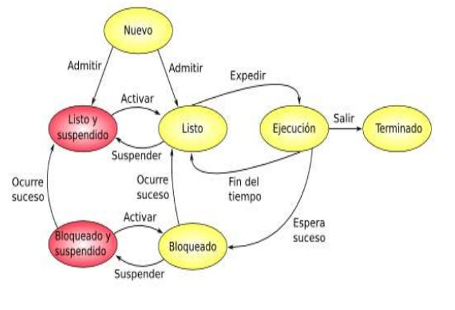

# UT02: INSTALACIÓN Y PUESTA EN MARCHA DE LINUX SERVER


## 5.- Gestión de procesos en Linux

### Índice

- [Introducción a los procesos](#51--introducción)
- [Procesos automáticos e interactivos](#52--procesos-automáticos-e-interactivos)
- [Procesos en primer y segundo plano](#53--procesos-en-primer-y-segundo-plano)
- [Comandos relacionados con los procesos](#53--procesos-en-primer-y-segundo-plano)
- [Envío de señales entre procesos](#55--envío-de-señales-entre-procesos-esto-no) **NO ENTRA**
- [Programación de procesos con `cron`](#56--programación-de-procesos-con-cron-y-crontab)
- [El directorio `/proc`](#57--el-directorio-proc)

### 5.1.- Introducción

Todos los ordenadores modernos pueden hacer varias cosas al mismo tiempo. Ahora bien, en términos estrictos la CPU únicamente pueden ejecutar un programa en un instante dado. Para
dar la sensación de simultaneidad en la ejecución lo que se hace es alternar la ejecución de varios programas muy rápidamente, lo que se conoce como pseudoparalelismo, en contraste con el verdadero paralelismo hardware de los sistemas multiprocesador.

En estos sistemas todo el software de la computadora se organiza en varios **procesos secuenciales**, o simplemente procesos. Un proceso no es más que un **programa en ejecución**, e incluye los valores que tienen el contador de programa, los registros y las variables. En lo conceptual cada proceso tiene su propia CPU virtual, aunque en la realidad la verdadera CPU cambia continuamente de un proceso a otro. Esta rápida conmutación se llama **multiprogramación**


#### 5.1.1.- Creación de procesos

En los sistemas operativos normalmente hace falta un mecanismo para crear y terminas procesos según se necesite durante la operación.

Hay cuatro sucesos principales que causan la creación de procesos:

- **Inicialización del sistema**: cuando se arranca el sistema operativo se crean varios procesos. Algunos son de **primer plano**, es decir, que interactúan con el usuario, y otros son en **segundo plano**, que no están asociados con un usuario en particular, sino que tienen una función específica, por ejemplo, podría diseñarse un proceso que acepte el correo electrónico entrante, el cual quedaría inactivo esperando la entrada de algún correo. A los procesos que se ejecutan en segundo plano se les denomina **demonios** (*daemons*)
- **Ejecución de una llamada al sistema para crear procesos por un programa en ejecución**: es normal que un proceso en ejecución emita llamadas al sistema para crear uno o más procesos que le ayuden en su labor. La creación de procesos tiene especial utilidad cuando el trabajo a realizar puede formularse con facilidad a partir de varios procesos relacionados, pero independientes, que interactúan entre sí.
- **Solicitud de un usuario para crear un proceso**: un usuario puede crear un proceso desde la línea de comandos del sistema o a través del entorno de ventanas.
- **Como parte de un trabajo por lotes**: esta situación solo se da en los sistemas por lotes de los mainframes grandes. En ellos los usuarios pueden enviar trabajos por lotes al sistema. Cuando el sistema operativo decide que tiene los recursos suficientes para ejecutar otro trabajo, crea un proceso y ejecuta en él el siguiente trabajo de la cola de entrada.

#### 5.1.2.- Terminación de procesos

Pero los procesos no están indefinidamente en la memoria, sino que tarde o temprano han de finalizar, debido principalmente a uno de los siguientes motivos:

- **Terminación normal**: una vez que el proceso ha finalizado las tareas que tenía que realizar se indica que ha terminado mediante una llamada al sistema operativo. Esta llamada en los sistemas UNIX es **exit**.
- **Terminación por error**: por ejemplo, cuando uno de los parámetros del proceso no es válido. Por lo general los procesos interactivos por pantalla no terminan cuando se les proporcionan parámetros no válidos, sino que muestran una ventana para reintroducir dichos parámetros.
- **Error fatal**: este motivo es producido por un error causado por el proceso, a menudo debido a un defecto en el programa, como hacer referencia a una posición de memoria no permitida o realizar una división entre cero.
- **Terminado por otro proceso**: en este caso otro proceso (que tiene los permisos necesarios) pide al sistema operativo que termine con el proceso. En UNIX la llamada es `kill`.


#### 5.1.3.- Estados de los procesos

A lo largo de su ciclo de vida un proceso puede pasar por varios estados entre los que va cambiando como respuesta a determinados eventos. Estos estados son:

- **En ejecución**: el proceso está utilizando la CPU en ese instante.
- **Bloqueado**: tarde o temprano los procesos deberán realizar lentas operaciones de E/S, por lo que cede el turno de CPU a otro proceso, pasando al estado bloqueado hasta que se produzca el suceso que está esperando.
- **Listo**: una vez que ocurra el evento que el proceso está esperando ya podrá volver a ejecutarse, aunque deberá esperar a que la CPU se encuentre disponible. También es posible que un proceso pase a este estado por decisión del planificador, por ejemplo, porque haya estado demasiado tiempo ocupando la CPU. Las transiciones entre los estados listo y en ejecución y viceversa son consecuencia de las acciones del calendarizador y de las cuales el proceso ni siquiera se entera. 
- **Nuevo**: lo tienen los procesos que acaban de ser creados por el sistema operativo pero que aún no han sido admitidos en el grupo de procesos ejecutables. En este estado el proceso ya tiene asignado identificador (PID, process identifier) y se han creado las estructuras de datos asociadas, pero el sistema aún no se ha comprometido a su ejecución.
- **Terminado**: corresponde a los procesos que han sido excluidos por el sistema operativo del grupo de procesos ejecutables, normalmente porque hayan finalizado su ejecución. Este estado permite conservar temporalmente las estructuras de datos asociadas al proceso, esto permite que programas auxiliares o de soporte puedan extraer información que necesiten, por ejemplo, un programa de auditoria.
- **Suspendido**: la enorme diferencia de velocidad entre el procesador y las operaciones de E/S hace que sea probable que todos los procesos que están en memoria se encuentren en estado bloqueado esperando la finalización de un evento de E/S. La solución a este problema es el **intercambio**, que significa mover un proceso de la memoria principal al disco para dejar espacio libre en memoria para otros procesos. En este caso se dice que el proceso se encuentra en estado **Bloqueado Suspendido**. Mientras el proceso se encuentra en este estado, puede ocurrir que el evento que espera tenga lugar, en cuyo caso pasará al estado **Listo Suspendido**, indicando que el proceso ya puede ejecutarse a la espera de ser trasladado a memoria.




### 5.2.- Procesos automáticos e interactivos

Una clasificación de los procesos que hay en Linux puede ser la que los divide en procesos automáticos e interactivos.

- **Procesos automáticos**: estos son los **servicios** o **daemons** que se inician automáticamente al arrancar el servidor. El responsable de lanzar todos estos procesos es `systemd`, tal y como veremos más adelante. Los demonios son procesos que se ejecutan en **segundo plano**, es decir, no tienen ninguna salida por la salida estándar.
- **Procesos interactivos**: son iniciados por los usuarios en *Shell*. Para iniciar un proceso interactivo, el usuario debe introducir el comando correspondiente.
  
Los procesos tienen una relación de parentesco donde cada proceso tiene un **proceso padre** que es el que le ha creado. Por ejemplo, un proceso interactivo iniciado en el terminal tiene como padre el proceso Bash correspondiente al terminal.

Cuando un proceso finaliza, debe enviar el estado de salida al proceso padre. Esto es requisito para que el proceso pueda finalizar su ejecución. Si por algún motivo el proceso no pudiera comunicarse con el proceso padre (por ejemplo, porque este hubiera finalizado su ejecución) el proceso hijo no podrá finalizar y quedará en un estado en el que no se podrá realizar ninguna tarea de administración con él. Un proceso que se encuentre en este estado se denomina **proceso zombi**.

Los conceptos de proceso padre e hijo se aplican a todos los procesos del sistema, siendo `systemd` el primer proceso de todos. Es posible ver la estructura jerárquica de los procesos utilizando el comando `pstree`.
 
```
vgonzalez@ubuntu:~$ pstree
systemd─┬─ModemManager───2*[{ModemManager}]
        ├─accounts-daemon───2*[{accounts-daemon}]
        ├─atd
        ├─cron
        ├─dbus-daemon
        ├─irqbalance───{irqbalance}
        ├─login───bash
        ├─multipathd───6*[{multipathd}]
```


### 5.3.- Procesos en primer y segundo plano

Los procesos interactivos se pueden clasificar como procesos en primer y en segundo plano. Los procesos en **primer plano** interactúan directamente con el usuario tomando el control de la terminal. Por el contrario, los procesos en **segundo plano**, aunque también son procesos hijos del Shell, están desvinculados de este en el sentido de que no envían ni la salida estándar ni la de errores al Shell.

Hay dos formas de crear un proceso en segundo plano:

- Poner el carácter *ampersand* (`&`) después del comando al iniciarlo. Esto hace que el proceso pase inmediatamente a segundo plano. Por ejemplo, `nmap 192.168.1.10 > ~/nmap.out &` ejecutará el comando `nmap` en segundo plano. Esto le permitirá realizar su función sin necesidad de que el usuario tenga que esperar su finalización para poder hacer otra cosa.
- Interrumpir el proceso con la combinación de teclas `Ctrl+Z` y luego utilizar el comando `bg` para reiniciarlo en segundo plano.
  
Aunque el comando se está ejecutando en segundo plano, sigue siendo posible controlarlo. Con el comando `jobs` se puede ver la lista de procesos en segundo plano


### 5.4.- Comandos relacionados con los procesos

#### 5.4.1.- Listado de procesos: `ps`

El comando `ps` lista todos los procesos del sistema, su estado, tamaño, nombre, propietario, tiempo de CPU, tiempo de reloj y otros muchos.

Este comando dispone de muchos modificadores, los más utilizados son los siguientes:

| Modificador | Descripción |
| ----------- | ----------- |
| `-a`        | Muestra todos los procesos, incluso los que no están controlados por ningún terminal |
| `-r`        | Muestra solo los procesos en ejecución |
| `-x`        | Muestra los procesos que no tienen un terminal controlado |
| `-u`        | Muestra los propietarios de los procesos |
| `-f`        | Visualiza las relaciones padre/hijo entre los procesos |
| `-l`        | Produce un listado en formato largo |
| `-w`        | Salida ancha, no se truncan las líneas para que entren en la misma línea |

Si invocamos la orden `ps –auxw` tendremos la siguiente salida:

```
vgonzalez@ubuntu:~$ ps -auxw
USER         PID %CPU %MEM    VSZ   RSS TTY      STAT START   TIME COMMAND
root           1  0.0  0.5 101936 11208 ?        Ss   10:05   0:01 /sbin/init
root           2  0.0  0.0      0     0 ?        S    10:05   0:00 [kthreadd]
root           3  0.0  0.0      0     0 ?        I<   10:05   0:00 [rcu_gp]
root           4  0.0  0.0      0     0 ?        I<   10:05   0:00 [rcu_par_gp]
root           6  0.0  0.0      0     0 ?        I<   10:05   0:00 [kworker/0:0H-kblockd]
root           9  0.0  0.0      0     0 ?        I<   10:05   0:00 [mm_percpu_wq]
root          10  0.0  0.0      0     0 ?        S    10:05   0:00 [ksoftirqd/0]
```

El significado de cada columna es el siguiente:

- `USER`: propietario del proceso
- `PID`: identificador del proceso
- `%CPU`: porcentaje de CPU utilizado por el proceso, en caso de tener varios *cores* en el sistema este valor puede ser superior a 100
- `%MEM`: porcentaje de memoria ocupada por el proceso.
- `VSZ`: Cantidad de memoria virtual utilizada por el proceso.
- `RSS`: La cantidad de memoria residente ocupada por el proceso
- `TTY`: Terminal controlado por el proceso. Una interrogación indica que no está asociado a ningún terminal.
- `STAT`: estado del proceso. Puede tener los siguientes valores:
	- `S`: El proceso está dormido. Quiere decir que el proceso está preparado para ejecutarse, pero está esperando a que otro proceso finalice su ejecución.
	- `R`: El proceso está actualmente en ejecución.
	- `D`: Dormido sin interrupción posible (normalmente quiere decir que está esperando a finalizar una operación de E/S)
	- `T`: El proceso está haciendo trazas por un depurador o ha sido parado.
	- `Z`: El proceso está en estado `zombi`. 
- `START`: Hora en que comenzó el proceso
- `TIME`: Cantidad de tiempo que el proceso ha gastado de CPU
- `COMMAND`: Nombre del comando que ha invocado el proceso y sus parámetros.


#### 5.4.2.- Visualización interactiva: `top`

El comando `top` es la versión interactiva de `ps`. Muestra los procesos, pero actualiza la información cada determinado tiempo. Además, permite al usuario realizar operaciones sobre los procesos mientras se ejecuta.

```
top - 11:21:03 up  1:15,  2 users,  load average: 0,00, 0,00, 0,00
Tasks: 106 total,   1 running, 105 sleeping,   0 stopped,   0 zombie
%Cpu(s):  0,0 us,  0,0 sy,  0,0 ni,100,0 id,  0,0 wa,  0,0 hi,  0,0 si,  0,0 st
MiB Mem :   1918,1 total,   1103,5 free,    191,3 used,    623,3 buff/cache
MiB Swap:   2048,0 total,   2048,0 free,      0,0 used.   1574,9 avail Mem

    PID USER      PR  NI    VIRT    RES    SHR S  %CPU  %MEM     TIME+ COMMAND
    396 root      20   0       0      0      0 I   0,3   0,0   0:03.45 kworker/0:3-events
   1958 vgonzal+  20   0    9232   3816   3168 R   0,3   0,2   0:00.01 top
      1 root      20   0  101936  11208   8200 S   0,0   0,6   0:01.13 systemd
      2 root      20   0       0      0      0 S   0,0   0,0   0:00.00 kthreadd
      3 root       0 -20       0      0      0 I   0,0   0,0   0:00.00 rcu_gp
      4 root       0 -20       0      0      0 I   0,0   0,0   0:00.00 rcu_par_gp
      6 root       0 -20       0      0      0 I   0,0   0,0   0:00.00 kworker/0:0H-kblockd
      9 root       0 -20       0      0      0 I   0,0   0,0   0:00.00 mm_percpu_wq
     10 root      20   0       0      0      0 S   0,0   0,0   0:00.09 ksoftirqd/0
     11 root      20   0       0      0      0 I   0,0   0,0   0:00.26 rcu_sched
     12 root      rt   0       0      0      0 S   0,0   0,0   0:00.03 migration/0
     13 root     -51   0       0      0      0 S   0,0   0,0   0:00.00 idle_inject/0
     14 root      20   0       0      0      0 S   0,0   0,0   0:00.00 cpuhp/0
     15 root      20   0       0      0      0 S   0,0   0,0   0:00.00 cpuhp/1
     16 root     -51   0       0      0      0 S   0,0   0,0   0:00.00 idle_inject/1
     17 root      rt   0       0      0      0 S   0,0   0,0   0:00.07 migration/1
     18 root      20   0       0      0      0 S   0,0   0,0   0:00.08 ksoftirqd/1
```

Este comando muestra también información general sobre el sistema en la parte superior. De esta información se puede destacar el **uptime**, o tiempo que lleva el servidor funcionando desde que fue arrancado, y la carga media del sistema en el último minuto, en los últimos 5 minutos y en los últimos 15 minutos.

La **carga media** es mostrada por un número que indica la actividad actual de la cola de procesos. El valor aquí se interpreta como el número de procesos que están esperando de media para hacer uso del procesador. En un sistema con un procesador y un núcleo, un valor de 1.00 indica que el sistema está continuamente ocupado procesando los procesos que hay en la cola, pero no hay procesos esperando en la cola.

Si el valor supera a 1.00, los procesos sufrirán esperas para ejecutarse, peores cuanto mayor sea el valor, por lo que es aconsejable que en el uso diario no exceda el valor de 1.00. Si el sistema tiene múltiples núcleos o *hyperthreading*, el valor aconsejable se incrementará proporcionalmente. Por ejemplo, un servidor con 8 núcleos e *hyperthreading* podría trabajar cómodamente con un valor próximo a 16.00

También muestra el número de procesos que hay actualmente en memoria, clasificados por tipos y el uso general tanto de CPU como de memoria.

Este comando dispone de varios modificadores:

| Modificador | Descripción |
| ------------| ----------- | 
| `-b`        | Se ejecuta en modo por lotes (batch). Esta opción es útil cuando se quiere redireccionar la salida a un fichero o a otro comando. Por defecto realiza una iteración pero se pueden realizar más utilizando el parámetro `–n num` |
| `-i`        | Ignora los procesos en estado *idle*, es decir, los inactivos. Solo muestra los procesos “interesantes” |

Además, el comando `top` dispone de algunas opciones interactivas:

| Opción | Descripción |
| ------ | ----------- |
| `k`    | Mata un proceso. Nos pedirá su PID y la señal a enviar al proceso (por defecto 15 – SIGTERM) |
| `n`    | Cambia el número de procesos que se muestran |
| `r`    | Cambia la prioridad de un proceso (*renice*). Pedirá el PID del proceso y el valor de la prioridad:  un valor positivo hará que el proceso pierda prioridad, un valor negativo aumentará la prioridad del proceso (esto solo puede hacerlo el usuario root) |


#### 5.4.3.- Envío de una señal a un proceso: `kill`

A pesar de su nombre este comando no mata procesos, sino que sirve para enviarles **señales** a los procesos en ejecución. El sistema operativo, por defecto, proporciona a cada proceso un conjunto estándar de **manejadores de señales** para gestionar las señales entrantes.

Algunas de las señales más importantes son las siguientes:

| Señal | Descripción |
| ----- | ----------- |
| `SIGHUP (1)`   | Esta señal es enviada por el Shell a todos los procesos cuando el usuario cierra sesión, lo que hace que se cierren dichos  procesos.
| `SIGINT (2)`   | Interrumpe la ejecución de un proceso. Es la señal enviada cuando pulsamos `Ctrl-C` |
| `SIGQUIT (3)`  | Muy similar a `SIGINT` |
| `SIGKILL (9)`  | Mata el proceso, finaliza su ejecución incondicional e inmediatamente. No puede ser ignorada por el proceso. |
| `SIGTERM (15)` | Solicita al proceso que finalice de una forma adecuada. |
| `SIGTSTP (20)` | Detiene temporalmente el proceso y lo deja preparado para continuar la ejecución. Es la señal enviada cuando pulsamos `Ctrl-Z` |
| `SIGCONT (18)` | Continúa la ejecución de un proceso parado. |

Cuando se invoca a `kill` se requiere al menos un parámetro: el **número de identificación del proceso (PID)**. Cuando solo se le pasa el PID la señal que se envía es la señal TERM (15).

El parámetro opcional para `kill` es `–n` donde n representa el número de señal.

La señal 9 es la forma brutal de finalizar un proceso. En lugar de pedirlo al proceso que se pare, el sistema operativo mata el proceso. La única vez que esto falla es cuando el proceso está en mitad de una llamada al sistema (como una petición de apertura de un archivo), en cuyo caso el proceso muere una vez que la llamada ha finalizado.

#### 5.4.4.- Visualizando la memoria: `free`

Muestra la cantidad de total de memoria física y de intercambio presente en el sistema, así como la memoria compartida y los buffers utilizados por el núcleo.

Sus modificadores son:

| Modificador | Descripción |
| ----------- | ----------- |
| - `-b|k|m`  | Muestra la cantidad de memoria en bytes, kilobytes o megabytes |
| - `-t`      | Muestra en una línea los totales |
| - `-s seg`  | Se actualiza cada seg segundos |


#### 5.4.5.- Tiempo de marcha: `uptime`

Muestra una línea con la siguiente información: hora actual, cuánto tiempo lleva en marcha el sistema, el número de usuarios actualmente conectados, y la carga media del sistema en los últimos 1, 5 y 15 minutos.

El valor de **carga media** tiene la misma interpretación que tenía en el caso del comando `top`.


#### 5.4.6.- Mostrar el nombre del sistema: `uname`

El comando uname imprime información acerca de la máquina y el sistema operativo en los que está corriendo. 
Los diferentes modificadores que tiene son:

| Modificador | Descripción |
|-------------|-------------|
| `-m`        | Escribe el tipo de hardware de la máquina |
| `-n`        | Escribe el nombre de la máquina |
| `-r`        | Escribe el número de versión del sistema operativo |
| `-s`        | Escribe el nombre del sistema operativo |
| `-v`        | Escribe la versión del sistema operativo |
| `-a`        | Escribe todo lo anterior |


### 5.5.- Envío de señales entre procesos (ESTO NO)

#### 5.5.1.- Captura de señales con el comando `trap`

Ya hemos visto que la comunicación entre procesos en Linux se realiza mediante señales que pueden ser lanzadas con el comando `kill`. 
Desde los scripts que creamos, también es posible capturar las señales, bien para modificar su valor por defecto o bien para bloquearla e impedir que realice su función. El comando para capturar señales en un script es el comando trap.
 
Cada vez que se presiona Ctrl+C, la señal es atrapada y ejecuta la orden que se le ha pasado al comando trap. 
En lugar de atrapar una señal se puede capturar la salida del script, o la finalización de este, indicándolo con la palabra EXIT.
 
Otra posibilidad es eliminar una trampa para que el script no responda ante una determinada señal. Esto lo conseguimos poniendo dos guiones donde se indica la orden de la trampa.
 
Ten cuidado porque si ejecutas el script anterior entrará en un bucle infinito y no podrás finalizarlo con la combinación de teclas Ctrl+C (ya que estamos atrapando estas señales). La única forma de finalizarlo será enviando una señal diferente con el comando kill, por ejemplo, SIGKILL.
También se pueden capturar varias señales en la misma orden de la siguiente forma:
 
6.4.2.- EJECUCIÓN DE SCRIPT CON LA SESIÓN CERRADA

Cuando cerramos la sesión, el Shell envía la señal SIGHUP a todos los procesos que cuelgan bajo él. Esta señal hace que los procesos finalicen su ejecución, pero esto en ocasiones no es lo deseable si queremos que los scripts continúen ejecutándose más allá de la sesión del usuario. Para evitar esto se dispone del comando nohup.
La sintaxis es muy sencilla, simplemente se le debe pasar el comando exactamente igual que si lo hubiéramos ejecutado.
 
Una cuestión a tener en cuenta es la gestión que se realiza de la salida estándar y de error del comando ejecutado, ya que al no haber terminal no puede mostrarla por pantalla.
Para ello, si la salida no está redirigida, la redirige al fichero nohup.out del directorio actual, y si no tuviera permiso de escritura sobre el directorio actual, al directorio personal del usuario. La salida de error se redirige al mismo lugar que la salida estándar.
Información adicional en:
•	http://www.vicente-navarro.com/blog/2007/04/19/sobre-la-senal-sighup-nohup-disown-trap/
•	https://likegeeks.com/es/scripting-de-bash-en-linux-senales-y-trabajos/


---
---

[Volver al índice de la unidad](index.md)

[Volver al índice del módulo](../../index.md)