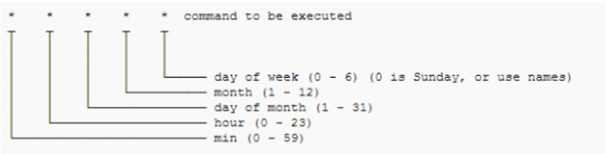

# UT02: INSTALACIÓN Y PUESTA EN MARCHA DE LINUX SERVER


## 6.- Programación de procesos con `cron` y `crontab`

### Índice

- [6.1.- Introducción](#61--introducción)
- [6.2.- El archivo `crontab`](#62--el-archivo-crontab)
- [6.3.- Creación de tareas por parte del usuario](#63-creación-de-tareas-por-parte-del-usuario)

### 6.1.- Introducción

El demonio `crond` permite a cualquier usuario de un sistema programar aplicaciones para ejecutar en cualquier fecha, hora o día de la semana. El uso del `cron` es una forma extremadamente eficiente de automatizar el sistema, generando informes en una base regular, y de realizar otras tareas periódicas.

Al igual que otros servicios `cron` se inicia mediante los scripts de arranque. Para localizarlos podemos ejecutar la orden:

```
$ ps auxw | grep cron | grep –v grep
```

El servicio `crond` trabaja despertándose cada minuto y comprobando el archivo crontab de cada usuario (directorio `/var/spool/cron`) así como el archivo `crontab` del sistema (`/etc/ crontab`). Este archivo contiene la lista de los eventos de los usuarios que quieren que se ejecuten en una fecha y hora en particular. Cualquier evento que coincida con la fecha y hora actual se ejecutará.


### 6.2.- El archivo `crontab`

La herramienta que permite editar entradas que ejecuta `cron` es `crontab`. Esencialmente todo lo que hace es verificar su permiso para modificar las configuraciones de `cron` y después invoca un editor de texto para que pueda realizar sus cambios.

Las tareas `cron` se definen en una serie de scripts dentro de los directorios definidos en el archivo `/etc/crontab`. Las listas de directorios dentro de este archivo tienen el siguiente aspecto:
 
```
vgonzalez@ubuntu:~$ cat /etc/crontab
# /etc/crontab: system-wide crontab
# Unlike any other crontab you don't have to run the `crontab'
# command to install the new version when you edit this file
# and files in /etc/cron.d. These files also have username fields,
# that none of the other crontabs do.

SHELL=/bin/sh
PATH=/usr/local/sbin:/usr/local/bin:/sbin:/bin:/usr/sbin:/usr/bin

# Example of job definition:
# .---------------- minute (0 - 59)
# |  .------------- hour (0 - 23)
# |  |  .---------- day of month (1 - 31)
# |  |  |  .------- month (1 - 12) OR jan,feb,mar,apr ...
# |  |  |  |  .---- day of week (0 - 6) (Sunday=0 or 7) OR sun,mon,tue,wed,thu,fri,sat
# |  |  |  |  |
# *  *  *  *  * user-name command to be executed
17 *    * * *   root    cd / && run-parts --report /etc/cron.hourly
25 6    * * *   root    test -x /usr/sbin/anacron || ( cd / && run-parts --report /etc/cron.daily )
47 6    * * 7   root    test -x /usr/sbin/anacron || ( cd / && run-parts --report /etc/cron.weekly )
52 6    1 * *   root    test -x /usr/sbin/anacron || ( cd / && run-parts --report /etc/cron.monthly )
```

No se debería modificar este archivo, pero vamos a ver las partes que tiene. Las primeras líneas indican los valores de las variables del *Shell*.

A continuación, hay cuatro líneas con una serie de columnas cada una, cada línea corresponde con una tarea programada. Los significados de las columnas son:

Las cinco primeras columnas representan los minutos, horas, día del mes, mes y día de la semana.
 


Hay diferentes formas de indicar estos valores:
- Si contiene un **valor numérico** indicará el momento exacto. Por ejemplo, la última fila tiene una tarea que se ejecutará a las 5:52 horas.
Una alternativa en los días de la semana y mes es utilizar abreviaturas de la forma sun o sug.
- Si contiene el **símbolo asterisco** indica que ese campo tomará todos los valores posibles. Por ejemplo, en la misma fila que antes (la última), al tener un asterisco en el campo mes indica que se ejecutará todos los meses. En cambio, como en el campo día del mes tiene un valor numérico, solo se ejecutará ese día concreto. Por tanto, esta tarea se ejecutará el primer día de cada mes todos los meses.
- Se pueden poner una serie de **valores separados por comas**, en cuyo caso la tarea se ejecutará para cada uno de los valores indicados.
- Otra opción es indicar días alternos poniéndolo **de la forma */num**, esto indicará que la tarea se ejecutará cuando el valor de ese campo sea múltiplo exacto de num.
- Otra opción es indicar **rangos** separando los dos valores con un guión (por ejemplo, 5-10).
- Por último, se pueden utilizar una serie de palabras reservadas. Estas son:
    - `@reboot`: se ejecuta una única vez al inicio.
    - `@yearly/@annually`: ejecutar cada año.
    - `@monthly`: ejecutar una vez al mes.
    - `@weekly`: una vez a la semana.
    - `@daily/@midnight`: una vez al día.
    - `@hourly`: cada hora.

La siguiente columna indica el **usuario** en cuyo nombre se ejecutará el script.

La última columna indica la tarea que se va a ejecutar. En este ejemplo concreto utiliza el comando `run-parts`. Este es un comando especial que ejecutará cualquier script ejecutable dentro del directorio especificado, en el último ejemplo sería el directorio `/etc/cron.monthly`.


### 6.3.-Creación de tareas por parte del usuario

Si analizas el fichero `crontab` anterior, verás que al final lo que hace es programar una serie de tareas con periodicidades fijas: cada hora, diaria, semanal, … de forma que cualquier script que se guarde en uno de los directorios indicados se ejecutará con dicha periodicidad. Por ejemplo, todo lo que se guarde en `/etc/cron/weekly` se ejecutará una vez cada semana. 

Eso es una tarea propia del administrador, pero los usuarios normales también pueden crear tareas de `cron`. Para crear y modificar una `crontab` utilizaremos el comando `crontab –e`. Si aún no existe una `crontab` para el usuario, este comando creará un archivo `crontab` en `/var/spool/cron/username`.

La sintaxis utilizada en los trabajos cron de los usuarios es idéntica a la del archivo `crontab` del sistema que vimos anteriormente, con una diferencia: no podemos indicar el nombre del usuario, ya que la tarea pertenecerá siempre al usuario que la cree.

Para crear una tarea cron debemos invocar la orden `crontab` con el modificador `–e`. Eso nos abrirá un editor donde podremos añadir nuestra línea. La primera vez que lo invoquemos nos pedirá un editor por defecto 
 
```bash
victor@SERVER:~$ crontab -e
no crontab for victor - using an empty one

Select an editor.  To change later, run 'select-editor'.
  1. /bin/nano        <---- easiest
  2. /usr/bin/vim.basic
  3. /usr/bin/vim.tiny
  4. /bin/ed

Choose 1-4 [1]: 1

```

Y tras ello ya podremos introducir datos en nuestro fichero crontab.

```bash
# DO NOT EDIT THIS FILE - edit the master and reinstall.
# (/tmp/crontab.dTvAKM/crontab installed on Sun Oct 13 09:16:24 2024)
# (Cron version -- $Id: crontab.c,v 2.13 1994/01/17 03:20:37 vixie Exp $)
# Edit this file to introduce tasks to be run by cron.
#
# Each task to run has to be defined through a single line
# indicating with different fields when the task will be run
# and what command to run for the task
#
# To define the time you can provide concrete values for
# minute (m), hour (h), day of month (dom), month (mon),
# and day of week (dow) or use '*' in these fields (for 'any').
#
# Notice that tasks will be started based on the cron's system
# daemon's notion of time and timezones.
#
# Output of the crontab jobs (including errors) is sent through
# email to the user the crontab file belongs to (unless redirected).
#
# For example, you can run a backup of all your user accounts
# at 5 a.m every week with:
# 0 5 * * 1 tar -zcf /var/backups/home.tgz /home/
#
# For more information see the manual pages of crontab(5) and cron(8)
#
# m h  dom mon dow   command
*/2 * * * * [ -e /tmp/log ] && rm -f /tmp/log

```

 
Algunas otras tareas que podemos realizar con `crontab` son:
- `crontab –l`: muestra nuestro fichero crontab para ver todas las tareas programadas.
- `crontab –u user –l`: si somos administradores podremos ver las tareas programadas de cualquier usuario del sistema.
- `crontab –r`: elimina todas las tareas de crontab. Esto hace que se elimine el fichero `/var/spool/cron/user`.

Por parte del administrador, es posible restringir los usuarios que pueden programar tareas en el sistema. Esto se hace mediante dos ficheros: `cron.allow` y `cron.deny`. El contenido de estos ficheros es muy sencillo, únicamente tienen una lista de nombres de usuario, uno por línea.
Funcionan de la siguiente manera:

- Si `cron.allow` existe, solo los usuarios que están listados en dicho fichero pueden crear, editar, mostrar o eliminar ficheros crontab.
- Si `cron.allow` no existe, todos los usuario pueden usar ficheros crontab con excepción de los que están incluidos en el fichero cron.deny.
- Si no existen ni `cron.allow` ni `cron.deny`, entonces cualquier usuario puede programar tareas.


---
---

[Volver al índice de la unidad](index.md)

[Volver al índice del módulo](../../index.md)