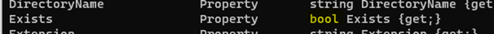

# PR0403: El pipeline en Powershell

Realiza las siguientes tareas que se te piden utilizando **Powershell**. Para contestar lo mejor es que hagas una captura de pantalla donde se vea el comando que has introducido y las primeras líneas de la salida de este.

1. El comando `Get-Date` muestra la fecha y hora actual. Muestra por pantalla únicamente el año en que estamos.

2. Uno de los requisitos de Windows 11 es que es procesador tenga **TPM** habilitado. Powershell dispone del comando `Get-TPM` que nos muestra información sobre este módulo. Muestra por pantalla, en formato tabla, las propiedades `TpmPresent`, `TpmReady`, `TpmEnabled` y `TpmActivated`.

En los siguientes ejercicios trabajaremos con los ficheros devueltos por el comando `Get-ChildItem C:\Windows\System32`.

3. Muestra por pantalla el número de ficheros y directorios que hay en ese directorio.

4. Los objetos devueltos por el comando anterior tienen una propiedad denominada `Extension`, que indica la extensión del archivo. Calcula el número de ficheros en el directorio que tienen la extensión `.dll`.

5. Muestra los ficheros del directorio con extensión `.exe` que tengan un tamaño superior a 50000 bytes.

6. Muestra los ficheros de este directorio que tengan extensión `.dll`, ordenados por fecha de creación y mostrando únicamente las propiedades de fecha de creación (`CreationTime`), último acceso (`LastAccessTime`) y nombre (`Name`).

7. Muestra el tamaño (`Length`) y nombre completo (`FullName`) de todos los ficheros del directorio ordenados por tamaño en sentido descendente.

8. Muestra el tamaño y nombre completo de todos los ficheros del directorio que tengan un tamaño superior a 10MB (10000000 bytes) ordenados por tamaño.

9. Muestra el tamaño y nombre completo de todos los ficheros del directorio que tengan un tamaño superior a 10MB y extensión `.exe` ordenados por tamaño.


## Ayuda para realizar la práctica

Hemos visto cómo usar el comando `Where-Object` para filtrar objetos con propiedades de tipo texto o numérico (por ejemplo, `Where-Object CPU -gt 1` o `Where-Object Name -eq "Notepad"`, sin embargo, hay propiedades que pueden tener otro tipo de datos. Dos de estos datos son los **booleanos** y los de **tipo fecha**.

### Propiedades booleanas

Las propiedades booleanas son las que pueden tener un valor de **Verdadero** o **Falso**, por ejemplo, la propiedad `Exists` del comando `Get-ChildItem`.


 
Cuando queremos filtrar por estas propiedades y queremos poner que un valor es verdadero o falso, no podemos poner directamente True o False, ya que el sistema las interpretará como cadenas de texto en lugar de hacerlo como valores booleanos. En estos casos, es necesario utilizar dos variables del sistema que representaremos de la forma `$True` y `$False`.

### Propiedades de tipo fecha

Otro tipo de propiedades muy común son las de **fecha y hora**, que podemos encontrar por ejemplo en la fecha de creación de un fichero.

```powershell
PS C:\> Get-ChildItem | Get-Member CreationTime


   TypeName: System.IO.DirectoryInfo

Name         MemberType Definition
----         ---------- ----------
CreationTime Property   datetime CreationTime {get;set;}
```

Aquí encontramos el mismo problema que en el caso anterior ya que si ponemos la fecha directamente la interpretará como una cadena. En este caso, hay que utilizar el comando `Get-Date` con el parámetro `-date` que convierte una fecha en modo texto a un objeto de tipo `datetime` que almacena dicha fecha.

```powershell
PS C:\> Get-Date -Date "25 de noviembre de 2014"

martes, 25 de noviembre de 2014 0:00:00
```

Pero ahora hay otro problema, ¿cómo hacemos para incluir el valor devuelto por este comando en el parámetro de otro comando? En este caso tenemos que recurrir a los paréntesis de la siguiente forma:

```powershell
PS C:\> Get-ChildItem | `
>>         Where-Object `
>>            -Property CreationTime `
>>            -gt ( Get-Date -Date "25 de noviembre de 2020")

    Directorio: C:\

Mode                 LastWriteTime         Length Name
----                 -------------         ------ ----
d-----        23/11/2024     17:54                $WINDOWS.~BT
d-----        13/10/2024     20:57                AMD
d-----        23/11/2024     17:55                ESD
```


Los **paréntesis** hacen que en primer lugar se ejecute el comando que hay en su interior y, el valor devuelto por dicho comando reemplazará todo lo que hay entre paréntesis.
Hay diversas formas de indicar la fecha que se le pasa al comando `Get-Date`, tanto con fecha y hora como solo fecha. Algunos ejemplos son:
- `"2 de noviembre de 2021 10:05:00"`
- `"02/11/2021"`
- `"02/11/21 10:10:30"`
- `"2021-02-11"`

Teniendo en cuenta lo anterior, realiza los siguientes ejercicios:

10. Muestra todos los procesos que tienen el estado `Responding` puesto a `False`, es decir, todos los procesos del sistema que se hayan colgado.

11. Muestra todos los ficheros de `C:\Windows` que hayan sido creados con fecha posterior al 15 de octubre de este año.
