# UT03: LENGUAJES DE SCRIPTING EN LINUX: BASH


## 1.- Compartición de carpetas con Samba

### 1.1.- Introducción

Samba es una implementación libre del protocolo de archivos compartidos de Microsoft, conocido como **SMB** o más recientemente CIFS.  El objetivo de Samba es la interoperabilidad entre máquinas Windows u Linux, permitiendo cualquier tipo de interacción entre ellas, desde acceder o crear carpetas compartidas, hasta agregar equipos Linux a un dominio de Active Directory e incluso hacer que una máquina Linux funcione como controlador de dominio.

El primer paso para trabajar con Samba es instalar los paquetes necesarios: `samba` y `smbclient`. Una vez instalados veremos que se ha creado el directorio `/etc/samba`, dentro del cual encontraremos el fichero con el que configuraremos todo lo relativo a Samba: el fichero `smb.conf`.

### 1.2.- El fichero `smb.conf`

Este fichero es muy extenso, pero está bien documentado mediante comentarios. Si aun así necesitas más información puedes recurrir a la página del manual de este.

**Imagen**

A grandes rasgos, este fichero se divide en dos partes:

- `Global settings` que abarca aspectos globales sobre el funcionamiento de Samba, 
- `Share definitions` que enumera los recursos que se comparten por la red.

El fichero está separado en secciones, identificadas con corchetes. Además, todas las opciones están comentadas. Observa que todas las líneas que comienzan por almohadilla o punto y coma son comentarios, y por tanto ignoradas.

Como se ha dicho, la parte donde se especifican los recursos que se van a compartir por la red es la etiquetada como `Share definitions`. Aquí se enumeran los recursos compartidos en diferentes secciones encabezadas por el nombre del recurso compartido rodeado de corchetes.

### 1.3.- Compartir una carpeta pública

El primer paso que tenemos que realizar será crear el directorio en el sistema de ficheros local que será compartido en la red.

Por cuestiones de orden, es aconsejable crear un directorio donde alojar todos los directorios que compartiremos en la red. En este caso supondremos que ya hemos creado un directorio `/samba` que alojará todos los directorios que se compartirán.
Dentro de ese directorio creamos el directorio que compartiremos y, dado que va a ser público, damos permisos de lectura y escritura a todos los usuarios y le asignamos la propiedad al usuario `nobody`.

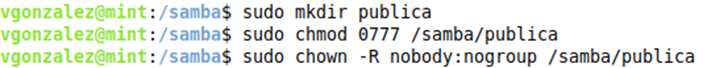

Ahora vamos a editar el fichero `smb.conf` para compartir esta carpeta. Como siempre que vamos a modificar un fichero de configuración, es altamente recomendable realizar una copia de seguridad del mismo para poder recuperarlo en caso de cometer algún error en la configuración.


Editamos el fichero y añadimos las siguientes líneas al final del mismo:

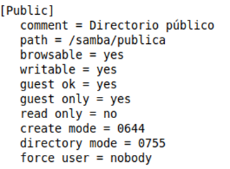

Los parámetros indicados son:

- `comment`: texto que se mostrará cuando el cliente consulte al servidor por los recursos compartidos que tiene.
- `path`: ruta local de la carpeta que compartimos.
- `browsable`: indica que la carpeta se mostrará cuando el cliente navegue por los recursos de red.
- `writable` - `writeable` - `read only`: son opciones equivalentes para indicar que la carpeta es de lectura y escritura.
- `guest ok`: un valor de yes en este parámetro indica que no se pedirá contraseña al conectarse al recurso compartido.
- `guest only`: indica que únicamente se permitirán conexiones de usuarios sin contraseña.
- `create mode` - `create mask`: indica los permisos que tendrán los ficheros que se creen desde el cliente en la carpeta compartida.
- `directory mode` - `directory mask`: equivalente al anterior, pero para el caso de los directorios creados.
- `foce user`: obliga a que todas las conexiones se realicen en el nombre del usuario que se indique, independiente del usuario que realice la misma.

Para asegurarnos de no haber cometido ningún error en la edición del fichero de configuración, podemos recurrir al comando `testparm`, que verifica el fichero `/etc/samba/smb.conf` y nos avisa de todos los problemas sintácticos que pueda haber en el mismo.

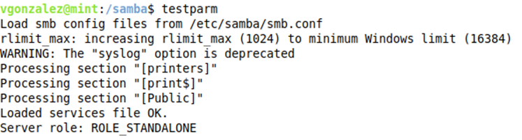

Ahora ya solo nos resta reiniciar el servicio para que se apliquen los mismos. Recuerda que esta operación la realizamos con el comando `systemctl`. El nombre del servicio que corresponde a Samba es `smbd`.

Y ya podremos acceder desde cualquier equipo a la carpeta compartida.

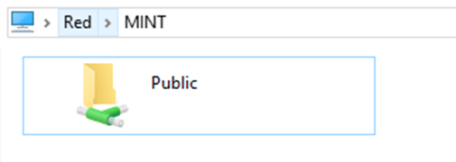


### 1.4.- Compartir una carpeta con contraseña

Si queremos compartir una carpeta en la red, pero solicitando una contraseña para que un usuario pueda acceder a ella, tenemos que realizar los siguientes pasos.

El primer paso será crear un grupo y un usuario, que serán los que tengan permisos de acceso sobre la carpeta.

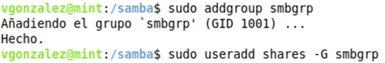

Vamos a darle ahora una contraseña a este usuario, pero será una contraseña para Samba, no para acceder al sistema, por lo que lo haremos utilizando el comando `smbpasswd`.

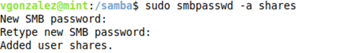

Si en algún momento queremos saber que usuarios tienen acceso a Samba, es decir, a qué usuarios les hemos asignado una contraseña en Samba, podemos recurrir al comando `pdbedit`.


Al igual que hicimos antes, vamos a crear la carpeta que vamos a compartir y a darle permisos. En este caso, el nuevo propietario será el grupo que hemos creado y además nos aseguraremos de que el resto de los usuarios no tengan permisos sobre la carpeta.

Observa que hemos dejado a `root` como propietario, lo que nos permitirá seguir accediendo como administradores a la carpeta desde el mismo equipo.

Ahora editamos el fichero `/etc/samba/smb.conf` y añadimos las siguientes líneas:

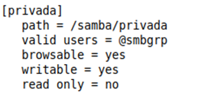

Hemos usado un parámetro nuevo:

- `valid users`: listado de usuarios que pueden acceder a la carpeta compartida.
- `invalid users`: en este ejemplo no se utiliza, pero podría servir para indicar a qué usuarios no les permitimos acceso al recurso compartido.

Ya solo queda verificar que no haya errores en el fichero con el comando `testparm` y reiniciar el servicio para que se apliquen los cambios.

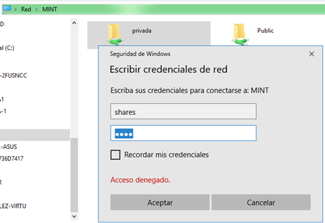


### 1.5.- Acceso a recursos compartidos desde Linux

Obviamente, también podremos **acceder desde un cliente Linux a un recurso compartido en la red**, bien sea una carpeta compartida en Windows o un directorio compartido con Samba desde otro equipo Linux.

Vamos a ilustrarlo con un ejemplo en el que compartimos una carpeta en una máquina Windows. En esta máquina compartiremos la carpeta en el menú contextual de la misma y *Propiedades -> Compartir -> Uso compartido avanzado*. Hacemos click en *Compartir*, cambiamos el nombre del recurso compartido si deseamos y asignamos permisos. En este caso pondremos permisos de lectura y escritura al usuario Administrador.

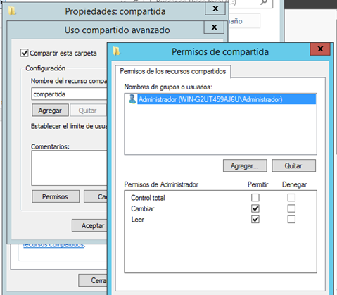

El siguiente paso será crear un usuario en la máquina Linux con el mismo nombre que el usuario en Windows que tenga permisos de acceso sobre la carpeta. Tras crear el usuario tendremos que agregarlo a Samba asociándole una contraseña tal y como hicimos en el apartado anterior.


Vamos a usar ahora el comando `smbclient` para ver que recursos compartidos hay en la máquina remota. Necesitaremos las credenciales de un usuario que esté creado en la máquina a la que nos conectamos. Por defecto, utilizará el mismo nombre de usuario con el que tenemos iniciada sesión en Linux, por lo que si queremos indicar un usuario diferente deberemos utilizar el modificador `-U` para indicarlo. Usamos también el modificador `--list` para indicar que queremos un listado de recursos compartidos.

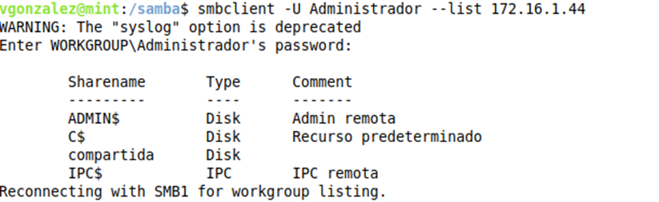

Para acceder a la carpeta compartida deberemos montarla en una carpeta del sistema con la orden `mount`.

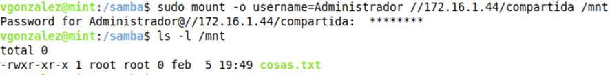


## 2.- Compartición de ficheros con NFS

**NFS (Network File System)** es un protocolo del nivel de aplicación que permite acceder a archivos remotos como si se tratara de ficheros locales. Es especialmente utilizado en entornos en que los clientes son principalmente máquinas Linux (por ejemplo, es común alojar todos los directorios personales de los usuarios en un servidor NFS), aunque también se puede integrar en sistemas que disponen de máquinas Windows.

### 2.1.- Preparación del servidor NFS

El primer paso será instalar los paquetes necesarios en el servidor. En concreto, el paquete necesario es `nfs-kernel-server`. Tras instalarlo ya podremos ver que el servicio correspondiente a NFS está en funcionamiento:

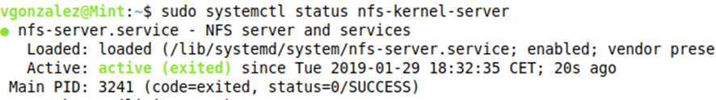

Los ficheros de configuración de un servidor NFS son:

- `/etc/default/nfs-common`
- `/etc/default/nfs-kernel-server`
- `/etc/exports`

Los dos primeros son utilizados para la configuración general de funcionamiento del servidor, mientras que el tercer fichero es el que nos interesa ya que es donde se especifican los recursos que se compartirán mediante NFS.

### 2.2.- Configuración del fichero `exports`

Como hemos dicho, la configuración de los recursos compartidos en NFS se hace mediante el fichero `/etc/exports`. Cada una de las líneas de este fichero tiene la siguiente estructura:

    `directorio hosts-permitidos(opciones)`

Donde:
- `directorio`: es el nombre del directorio que se quiere compartir
- `hosts-permitidos`: indica los equipos que están autorizados a acceder a dicho directorio. Los equipos se pueden indicar de diferentes formas:
    - El nombre de un equipo individual
    - La dirección IP del equipo
    - Una red indicada como combinación de la dirección de la red y la máscara. Por ejemplo, 192.168.1.0/255.255.255.0
    - Cualquier equipo, indicado mediante un asterisco.
- `opciones`: finalmente se indican las opciones que indican como será el acceso a dicho recursos. Algunas de las más comunes son:
    - `ro`: el sistema de ficheros es exportado como sistema de ficheros de solo lectura. Independientemente de los permisos que tenga el usuario, el sistema de ficheros impide cualquier modificación, aunque el usuario sea root.
    - `rw`: el sistema de ficheros es exportado como sistema de lectura y escritura, por lo que se aplicarán los permisos que tenga el usuario en el sistema de ficheros local
    - `root_squash`: el ID del usuario root es mapeado al usuario con ID 65534, que por defecto pertenece al usuario nobody. Esto garantiza que el usuario que está montando un sistema NFS como root en una estación de trabajo no tenga acceso root en el directorio del servidor.
    - `no_root_squash`: Con esta opción, no hay ninguna limitación para el usuario root. Obviamente, hay que tener mucho cuidado al aplicarla.
    - `all_squash`: esta opción se utiliza cuando se quiere limitar los permisos de todos los usuarios que acceden por NFS. Con ella, todos los usuarios tendrán los permisos del usuario nobody. Es la opción aconsejada cuando se quiere maximizar la seguridad.
    - `sync`: esta opción asegura que los cambios en los ficheros han sido escritos en el sistema de ficheros antes de garantizar acceso a otros usuarios al mismo fichero. Esto garantiza la integridad de los datos a costa de un peor rendimiento.

Tras realizar cambios en el fichero `/etc/exports` debes recordar reiniciar el servicio llamado `nfs-kernel-server`.

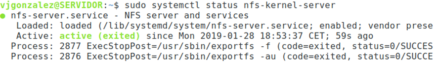


### 2.2.- Configuración del cliente

Una vez que el servidor NFS está funcionando y en ejecución, puedes configurar los clientes para acceder al mismo. Este acceso se puede realizar manualmente con el comando `mount` o bien automáticamente mediante el fichero `fstab`.

Independientemente del método utilizado, necesitaremos instalar los paquetes `portmap` y `nfs-common` para que nuestro equipo pueda conectarse a carpetas NFS.

#### Montando una carpeta NFS mediante el comando `mount`

La forma más rápida de acceder a una carpeta NFS es utilizando el comando `mount` en la línea de comandos. Simplemente hay que indicar que queremos montar un sistema de ficheros NFS, dónde está y dónde lo queremos montar, y ya estará accesible.

Por ejemplo, la siguiente línea monta la carpeta NFS `/opt` que se encuentra en el servidor cuya IP se indica, en la carpeta local `/mnt`.

```bash
mount -t nfs 10.0.0.1:/opt /mnt
```

Aunque se puede montar una carpeta NFS tal como se ha indicado, hay una serie de opciones que pueden ser interesantes:

- `soft`: con esta opción indicamos que no queremos que insista indefinidamente intentando montar la carpeta. Si el directorio no puede ser montado tras un periodo por defecto (normalmente 60 segundos), la operación es abortada.
- `hard`: la carpeta intentará montarse indefinidamente. Solo hay que utilizarlo cuando la carpeta sea estrictamente necesaria ya que si el montaje es realizado durante el inicio del sistema puede ocurrir que quede colgado.
- `fg`: esta es la opción por defecto e indica que el montaje debe realizarse en primer plano, de forma que el usuario no puede hacer nada hasta que haya finalizado el montaje.
- `bg`: el montaje se realiza en segundo plano, por lo que no interfiere con el usuario.
- `rsize=n`: esta opción especifica el número de bytes que el cliente lee del servidor cada vez. Por razones de compatibilidad, su valor está establecido a 1024 bytes, pero se puede mejorar el rendimiento global indicando un valor superior, por ejemplo, 8192 bytes.
- `wsize=n`: con esta opción se indican el número máximo de bytes que son escritos simultáneamente. De nuevo, el valor por defecto es 1024 bytes, pero se puede optimizar el rendimiento indicando un valor superior.
- `retry=n`: esta opción especifica el número de minutos que se debe esperar intentando montar la carpeta. El valor por defecto es 10000 (6.94 días), por lo que es recomendable cambiar su valor.


#### Montaje automático con `fstab`

Aunque el uso del comando `mount` está bien cuando queremos tener un acceso ocasional a una carpeta, si queremos algo más permanente debemos utilizar el fichero `/etc/fstab`.

La única diferencia con respecto a las unidades locales montadas con este fichero es que hay que indicar el nombre completo del recurso NFS en lugar del dispositivo. Además, hay algunas opciones NFS que deben ser especificadas, en concreto, se deben incluir `_netdev` (obliga a esperar a que la red esté disponible antes de montar la carpeta), `rsize`, `wsize` y `soft` para un rendimiento óptimo.
 
 ```
172.16.1.90:/datos   /home/victor/datos   nfs   _netdev,rsize=8192,wsize=8192,soft
 ```

Una vez modificado el fichero `/etc/fstab` ya podemos montar el sistema de ficheros NFS con el comando `mount`. 


### 2.3.- Acceso a NFS desde Windows

Todas las versiones de Windows a partir de Windows 7 disponen de soporte para conectar a carpetas NFS como cliente. El soporte NFS viene como una característica de Windows, así que hemos de ir a *Panel de control -> Programas -> Activar o desactivar las características de Windows*. Ahí hemos de marcar la casilla correspondiente a *Cliente para NFS* y opcionalmente la casilla *Herramientas administrativas* que está a continuación.

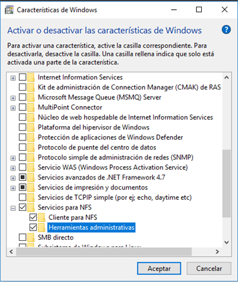

La instalación es bastante rápida y tras finalizar ya tendremos instalado el servicio de cliente NFS. Sin embargo, este servicio no estará en ejecución, por lo que tendremos que lanzarlo primero.

Esto se hace desde la línea de comandos o bien desde PowerShell, aunque necesitaremos privilegios de administrador, por lo que lo lanzamos como administradores.

Ejecutamos la orden:

```
nfsadmin client [ComputerName] start
```

donde `[ComputerName]` hace referencia al equipo donde queremos iniciar el servicio. En este caso indicamos `localhost`.

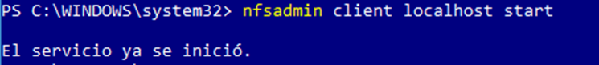

Ahora ya solo nos queda montar la carpeta NFS. Para ello volvemos a necesitar la línea de comandos (`cmd`, ya que para esta operación no podemos utilizar PowerShell), aunque en este caso no es necesario que seamos administradores. La sintaxis del comando es:

```
mount -o [opciones] \\servidor\carpeta letra
```

donde:
- `opciones`: es una de las siguientes opciones:
    - `anon`: acceso anónimo al directorio de la red
    - `nolock`: dehabilita el bloqueo. Puede mejorar el rendimiento si no es necesario realizar escrituras.
    - `r`: solo lectura
    - `casesensitive`: fuerza la búsqueda de archivos con distinción de mayúsculas y minúsculas.
- `servidor`: dirección IP o nombre del servidor que aloja la carpeta NFS
- `carpeta`: nombre del recurso NFS al que nos queremos conectar
- `letra`: letra que se asignará a la unidad de red. Se puede indicar un * para que asigne la primera letra disponible.

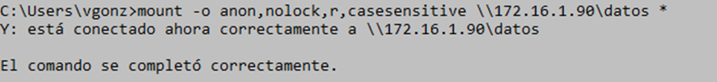

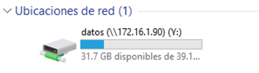


## 3.- Linux como cliente de Active Directory